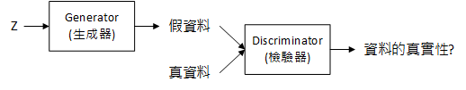

- 2020/07/11 [TensorFlow 2 quickstart for beginners](2020/07/20200711_python_tensorflow/learning.py) (partial)
  - Ref: [TensorFlow 2 quickstart for beginners](https://www.tensorflow.org/tutorials/quickstart/beginner)
- 2020/07/12 [CNN](2020/07/20200712_cnn/cnn.py) 1
- 2020/07/13 [Sequential, Dense, kernel_initializer](2020/07/20200713_tensorflow_Sequential/main.py)
- 2020/07/14 [MNIST learning 1](2020/07/20200714_tensorflow_learning_4/learning.py)
  - Epoch: 200, Layers: 1
  - accuracy on training: 0.9229
  - accuracy on validation: 0.9238
  - accuracy on test: 0.9218
- 2020/07/15 [MNIST improvement](2020/07/20200715_tensorflow_learning_5/learning.py)
  - Epoch: 50, Layers: 3, accuracy on training: 0.9707, accuracy on validation: 0.9648, accuracy on test: 0.9622
  - Epoch: 50, Layers: 3, accuracy on training: 0.9722, accuracy on validation: 0.9652, accuracy on test: 0.9654 (seed 0)
  - Epoch: 200, Layers: 3, accuracy on training: 0.9979, accuracy on validation: 0.9742, accuracy on test: 0.9758 (seed 0)
- 2020/07/16
  - [MNIST improvement](2020/07/20200716_tensorflow_learning_6/learning.py)
    - Epoch: 50, Layers: 5, accuracy on training: 0.9454, accuracy on validation: 0.9640, accuracy on test: 0.9621 (seed 0)
    - Epoch: 200, Layers: 5, accuracy on training: 0.9763, accuracy on validation: 0.9768, accuracy on test: 0.9763 (seed 0)
  - [improvement using RMSProp](2020/07/20200716_tensorflow_learning_6/learning_rmsprop.py)
    - Epoch: 10, Layers: 5, accuracy on training: 0.9723, accuracy on validation: 0.9755, accuracy on test: 0.9767 (seed 0)
    - Epoch: 250, Layers: 5, accuracy on training: 0.9895, accuracy on validation: 0.9780, accuracy on test: 0.9773 (seed 0)
  - [improvement using Adam](2020/07/20200716_tensorflow_learning_6/learning_adam.py)
    - Epoch: 50, Layers: 5, accuracy on training: 0.9896, accuracy on validation: 0.9793, accuracy on test: 0.9784 (seed 0)
- Regression
  - 2020/07/19 [learning 1](2020/07/20200719_tensorflow/learning.py)
  - 2020/07/20 [learning 2](2020/07/20200720_tensorflow_regression_2/learning.py)
  - 2020/07/21 [learning 3](2020/07/20200721_tensorflow_regression_3/learning.py)
  - 2020/07/22 [learning 4](2020/07/20200722_tensorflow_regression_4/learning.py)
  - 2020/07/23 [learning 5](2020/07/20200723_tensorflow_regression_5/learning.py)
- Convolutional Neural Network
  - 2020/07/24 [learning 1](2020/07/20200724_tensorflow_cnn_1/learning.py)
  - 2020/07/25 [learning 2](2020/07/20200725_tensorflow_cnn_2/learning.py)
  - 2020/07/26 [learning 3](2020/07/20200726_tensorflow_cnn_3/learning.py)
  - 2020/07/27 [learning 4](2020/07/20200727_tensorflow_cnn_4/learning.py)
  - 2020/07/28 [learning 5](2020/07/20200728_tensorflow_cnn_5/learning.py)
  - 2020/07/29 [learning 6 (VGG16)](2020/07/20200729_tensorflow_cnn_6/learning.py)
  - 2020/07/30 [learning 7](2020/07/20200730_tensorflow_cnn_7/learning.py)
- tf.keras estimator model
  - [2020/07/31](2020/07/20200731_tensorflow_estimator/learning.py)
- inception v3
  - [2020/08/01](2020/08/20200801_tensorflow_Inception_v3/learning.py)
  - [2020/08/02](2020/08/20200802_tensorflow_Inception_v3_2/learning.py)
  - [2020/08/03](2020/08/20200803_tensorflow_Inception_v3_3/learning.py)
  - [2020/08/04](2020/08/20200804_tensorflow_Inception_v3_4/learning.py)
  - [2020/08/06](2020/08/20200806_tensorflow_Inception_v3_5/learning.py)
  - [2020/08/07](2020/08/20200807_tensorflow_Inception_v3_6/learning.py)
- TensorFlow Hub
  - [2020/08/08](2020/08/20200808_tensorflow_hub/main.py)
- DeepDream Network
  - [2020/08/09](2020/08/20200809_deepdream_network_1/main.py)
  - [2020/08/10](2020/08/20200810_deepdream_network_2/main.py)
- Generative Adversarial Networks (GANs)
  - 